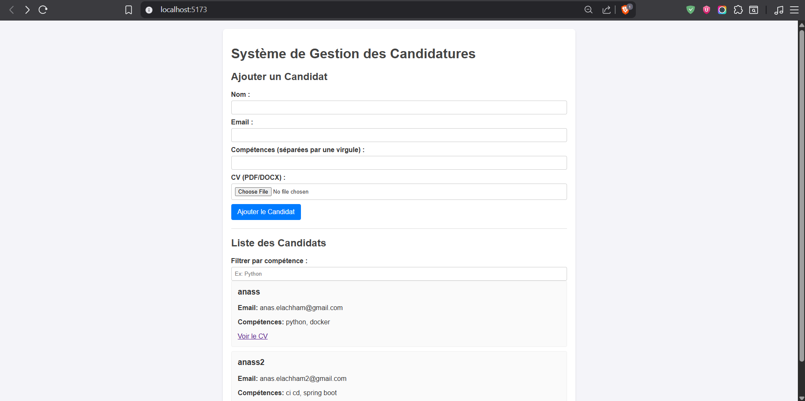
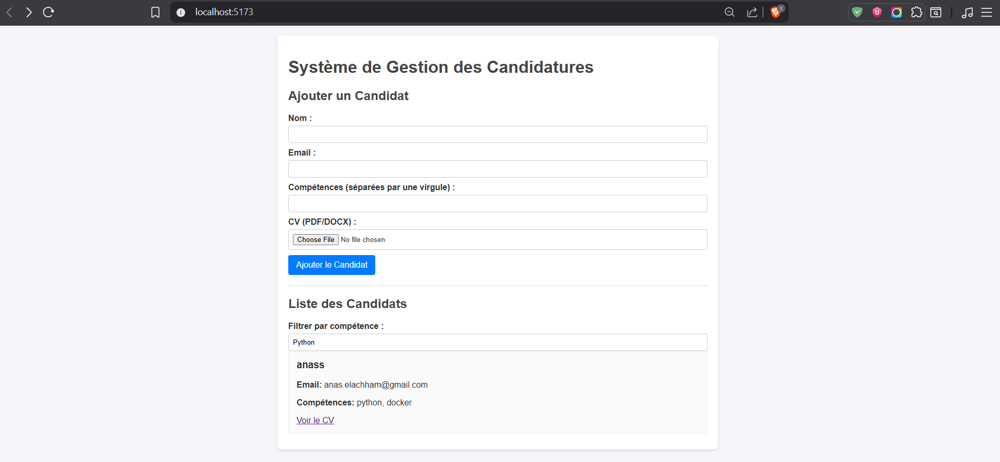
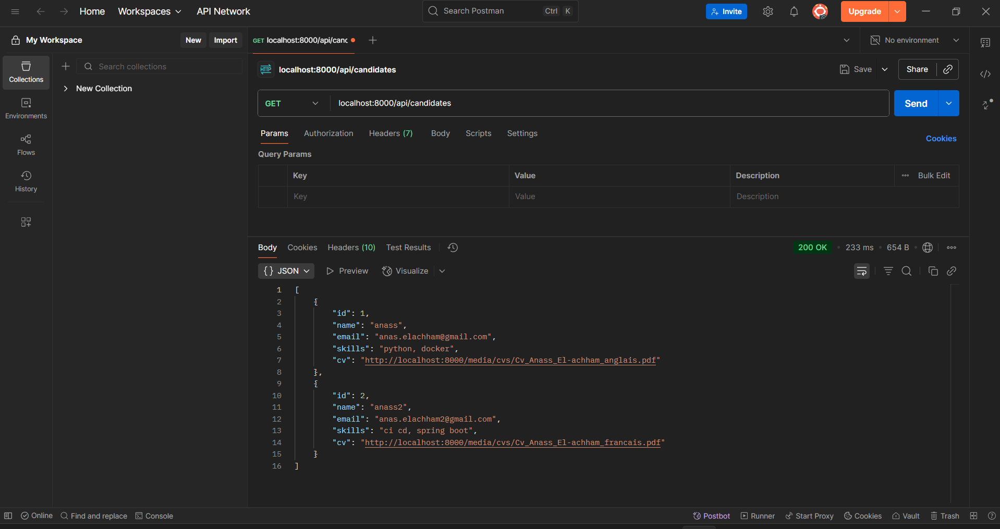
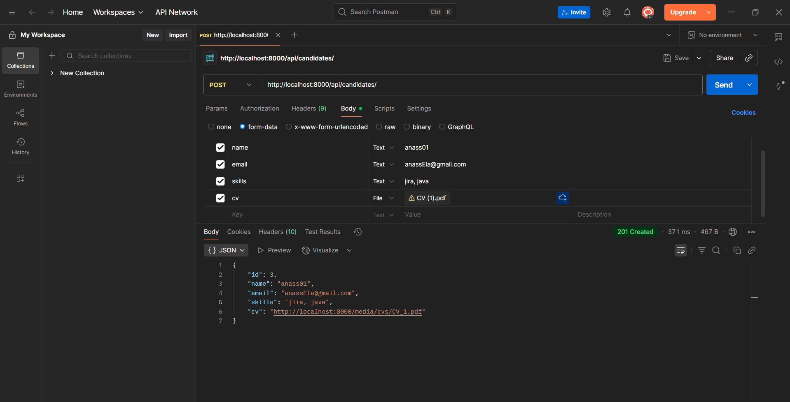
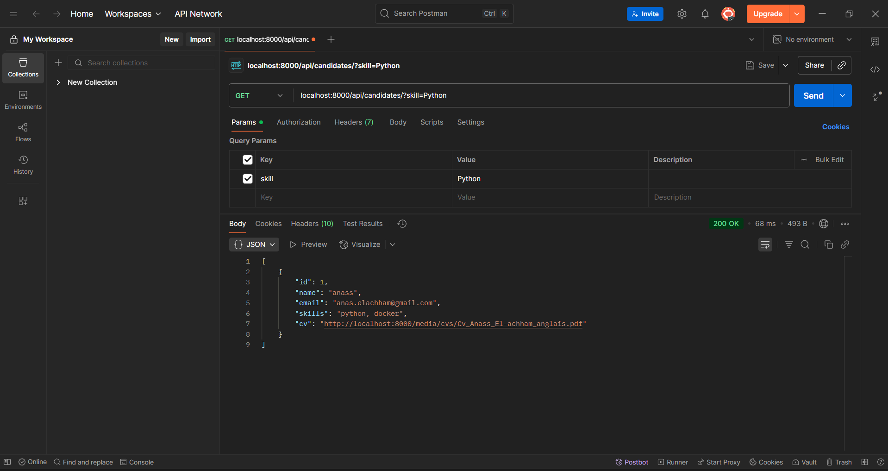

# Candidate Management System

A full-stack web application for managing job candidates, built with Django REST Framework and TypeScript. This project demonstrates end-to-end development capabilities including API design, database modeling, and modern frontend implementation.

## Table of Contents

- [Features](#-features)
- [Tech Stack](#-tech-stack)
- [Project Structure](#-project-structure)
- [Quick Start with Docker](#-quick-start-with-docker)
- [Manual Setup](#-manual-setup)
- [API Documentation](#-api-documentation)
- [Usage Examples](#-usage-examples)
- [Testing](#-testing)

## Features

- **Candidate Management**: Create, list, and search candidates
- **File Upload**: CV upload support (PDF, DOC, DOCX)
- **Real-time Filtering**: Dynamic search by skills using TypeScript
- **REST API**: Clean API endpoints with proper error handling
- **Responsive UI**: Modern interface with Vite + TypeScript
- **Dockerized**: Complete containerization for easy deployment
- **Type Safety**: Strict TypeScript typing throughout the frontend

## Tech Stack

### Backend
- **Django 4.2** - Web framework
- **Django REST Framework** - API development
- **PostgreSQL** - Database
- **Python-dotenv** - Environment management
- **django-cors-headers** - CORS handling

### Frontend
- **TypeScript** - Type-safe JavaScript
- **Vite** - Fast build tool and dev server
- **Axios** - HTTP client for API calls
- **Vanilla TypeScript**

### DevOps
- **Docker & Docker Compose** - Containerization
- **PostgreSQL 13** - Production-ready database

## Project Structure

```
mini-projet-pratique/
├── backend/
│   ├── api/
│   │   ├── models.py          # Candidate data model
│   │   ├── serializers.py     # API serialization
│   │   ├── views.py           # API endpoints
│   │   └── urls.py            # URL routing
│   ├── project_config/
│   │   ├── settings.py        # Django configuration
│   │   └── urls.py            # Main URL config
│   ├── requirements.txt       # Python dependencies
│   ├── manage.py             # Django management
│   └── Dockerfile            # Backend container config
├── frontend/
│   ├── src/
│   │   ├── main.ts           # Application entry point
│   │   ├── api.ts            # API communication layer
│   │   └── types.ts          # TypeScript type definitions
│   ├── package.json          # Node.js dependencies
│   └── Dockerfile            # Frontend container config
├── screenshots/
├── docker-compose.yml        # Multi-container orchestration
└── README.md                # This file
```

## Quick Start with Docker

### Prerequisites
- Docker and Docker Compose installed
- Git for cloning the repository

### 1. Clone and Start
```bash
# Clone the repository
git clone https://github.com/Leprince11/mini-projet-pratique.git
cd mini-projet-pratique

# Start all services
docker-compose up --build
```

### 2. Access the Application
- **Frontend**: http://localhost:5173
- **Backend API**: http://localhost:8000/api
- **Django Admin**: http://localhost:8000/admin

## Manual Setup

### Backend Setup
```bash
# Navigate to backend directory
cd backend

# Create virtual environment
python -m venv venv
source venv/bin/activate  # On Windows: venv\Scripts\activate

# Install dependencies
pip install -r requirements.txt

# Configure environment variables
cp .env.example .env
# Edit .env with your database credentials

# Run migrations
python manage.py makemigrations
python manage.py migrate

# Start development server
python manage.py runserver
```

### Frontend Setup
```bash
# Navigate to frontend directory
cd frontend

# Install dependencies
npm install

# Start development server
npm run dev
```

### Database Setup
Ensure PostgreSQL is running with the credentials specified in your `.env` file:
```bash
# Create database
createdb candidatures_db

# Or using PostgreSQL client
psql -U postgres -c "CREATE DATABASE candidatures_db;"
```

## 📚 API Documentation

### Base URL
```
http://localhost:8000/api
```

### Endpoints

#### 1. List All Candidates
```http
GET /api/candidates/
```

**Response:**
```json
[
  {
    "id": 1,
    "name": "anass",
    "email": "anas.elachham@gmail.com",
    "skills": "python, docker",
    "cv": "http://localhost:8000/media/cvs/Cv_Anass_El-achham_anglais.pdf"
  }
]
```

#### 2. Create New Candidate
```http
POST /api/candidates/
Content-Type: multipart/form-data
```

**Body:**
- `name`: String (required)
- `email`: String (required, unique)
- `skills`: String (required, comma-separated)
- `cv`: File (required, PDF/DOC/DOCX)

#### 3. Filter Candidates by Skill
```http
GET /api/candidates/?skill=Python
```

#### 4. Download Candidate CV
```http
GET /api/candidates/{id}/cv/
```

## Demo Screenshots

### Frontend Interface

#### Main Candidate List View

*The main interface showing all registered candidates with their information and CV download links*

#### Skill Filtering in Action

*Real-time filtering working - showing only candidates matching "Python" skill*


### API Testing Results

#### GET All Candidates - Postman Response

*Postman showing successful API response with candidate data*

#### POST Create Candidate - Postman Response

*Postman demonstrating successful candidate creation with file upload*

#### GET Filtered Candidates - Postman Response

*API filtering by skill parameter working correctly*

## Usage Examples

### Using Postman

1. **Create Candidate**:
   - Method: `POST`
   - URL: `http://localhost:8000/api/candidates/`
   - Body: `form-data`
   - Add fields: `name`, `email`, `skills`, `cv` (file)

2. **List Candidates**:
   - Method: `GET`
   - URL: `http://localhost:8000/api/candidates/`

3. **Filter by Skill**:
   - Method: `GET`
   - URL: `http://localhost:8000/api/candidates/?skill=Django`


## Environment Variables

Create a `.env` file in the backend directory:

```env
# Database Configuration
POSTGRES_DB=candidatures_db
POSTGRES_USER=postgres_user
POSTGRES_PASSWORD=your_secure_password
POSTGRES_HOST=localhost
POSTGRES_PORT=5432

# Django Settings
DEBUG=True
SECRET_KEY=your-secret-key-here
```

## Deployment Notes

For production deployment:
- Set `DEBUG=False` in environment variables
- Use environment-specific database credentials
- Configure `ALLOWED_HOSTS` in Django settings
- Use a production WSGI server like Gunicorn
- Set up proper SSL certificates

---

**Built for R&S TELECOM technical assessment**